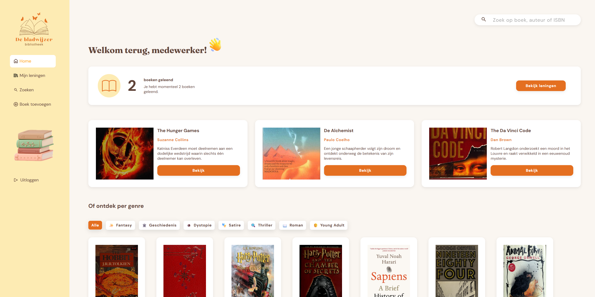

# De Bladwijzer

De Bladwijzer is een digitale bibliotheekapplicatie waarmee gebruikers boeken kunnen ontdekken, zoeken en lenen. Gebruikers kunnen het boekenaanbod filteren op genre, boekdetails bekijken en hun persoonlijke leningen bekijken. Medewerkers kunnen ook nieuwe boeken en auteurs aan de bibliotheek worden toegevoegd.

---

## Inhoudsopgave

1. [Over de applicatie](#over-de-applicatie)
2. [Belangrijkste functionaliteiten](#belangrijkste-functionaliteiten)
3. [Screenshot](#screenshot)
4. [Gebruikte technieken en frameworks](#gebruikte-technieken-en-frameworks)
5. [Benodigdheden](#benodigdheden)
6. [Project lokaal installeren](#project-lokaal-installeren)
7. [Omgevingsvariabelen configureren](#omgevingsvariabelen-configureren)
8. [Applicatie starten](#applicatie-starten)
9. [Inloggegevens](#inloggegevens)
10. [Beschikbare npm-commando's](#beschikbare-npm-commandos)
11. [Auteur](#auteur)

---

## Over de applicatie

De Bladwijzer is ontwikkeld als frontend-eindproject. De applicatie biedt een overzichtelijke omgeving waarin bibliotheekleden boeken kunnen bekijken en lenen.

Na het inloggen komt de gebruiker op een persoonlijke homepagina terecht. Hier worden de drie nieuwste boeken, actieve leningen en verschillende genres getoond. Vanuit het boekenoverzicht kan de gebruiker boekdetails bekijken en zoeken op titel, auteur of ISBN. Via het navigatiemenu kan de gebruiker naar het leningenoverzicht of de zoekpagina gaan. Medewerkers kunnen daarnaast nieuwe boeken toevoegen.

De applicatie maakt gebruik van de NOVI Dynamic API voor het opslaan en ophalen van gebruikers, boeken, auteurs, genres en leningen.

---

## Belangrijkste functionaliteiten

De applicatie bevat onder andere de volgende functionaliteiten:

- Een account registreren;
- Inloggen en uitloggen;
- Boeken zoeken op titel, auteur of ISBN;
- Boeken filteren op genre;
- Een beschikbaar boek lenen;
- Nieuwe boeken toevoegen;

---

## Screenshot

Onderstaande afbeelding toont de homepagina van De Bladwijzer.



---

## Gebruikte technieken en frameworks

### React

De gebruikersinterface is opgebouwd met React en bestaat uit herbruikbare componenten, zoals boekkaarten, knoppen, genretabs, navigatie en paginalayouts.

### React Router

React Router wordt gebruikt voor navigatie tussen onder andere:

- De homepagina;
- De zoekpagina;
- De boekdetailpagina;
- Mijn leningen;
- Boek toevoegen;
- Inloggen;
- Registreren.

### JavaScript en JSX

De applicatielogica is geschreven in JavaScript. Voor het opbouwen van React-componenten wordt JSX gebruikt. JSX maakt het mogelijk om HTML-achtige elementen binnen JavaScript te schrijven. Vite zet deze JSX-code tijdens het ontwikkelen en bouwen om naar JavaScript dat door de browser kan worden uitgevoerd.

Binnen het project worden onder andere asynchrone functies, array-methodes, destructuring, modules en herbruikbare React-componenten gebruikt.

### SCSS en CSS Modules

De styling is geschreven in SCSS. CSS Modules zorgen ervoor dat classnamen lokaal aan componenten zijn gekoppeld. Mixins worden gebruikt voor responsive breakpoints en variabelen voor de centrale huisstijl, zoals kleuren en lettertypen.

### Axios

Axios wordt gebruikt om HTTP-requests naar de backend-API uit te voeren.

### Context API

De React Context API wordt gebruikt om de authenticatiestatus en de ingelogde gebruiker beschikbaar te maken binnen de applicatie.

### JWT Decode

De package `jwt-decode` wordt gebruikt om gebruikersgegevens uit het ontvangen JSON Web Token te lezen.

### Vite

Vite wordt gebruikt als development- en buildtool.

### NPM

NPM wordt gebruikt voor het installeren en beheren van packages en voor het uitvoeren van scripts.

### NOVI Dynamic API

De applicatie gebruikt de NOVI Dynamic API voor de volgende gegevens:

- Gebruikers;
- Boeken;
- Auteurs;
- Genres;
- Leningen.

---

## Benodigdheden

Voor het lokaal installeren en uitvoeren van het project zijn de volgende onderdelen nodig:

- Node.js, bij voorkeur versie 18 of hoger;
- NPM;
- Een moderne webbrowser, bijvoorbeeld Google Chrome;
- Git, wanneer het project via een Git-repository wordt gedownload;
- De meegeleverde NOVI project-ID/API-key.

Controleer de geïnstalleerde versies met:

```bash
node --version
npm --version
```
---

## Project lokaal installeren

### 1. Repository downloaden

Clone de repository:

```bash
git clone https://github.com/LeonieHarteveld/de-bladwijzer-applicatie
```

Ga daarna naar de projectmap:

```bash
cd de-bladwijzer-applicatie
```

Het project kan ook als ZIP-bestand worden gedownload. Pak het bestand uit en open de uitgepakte projectmap in een terminal.

### 2. Dependencies installeren

Installeer alle packages uit `package.json`:

```bash
npm install
```

Hierdoor wordt lokaal een map `node_modules` aangemaakt.

---

## Omgevingsvariabelen configureren

De applicatie gebruikt de **NOVI Dynamic API**. Hiervoor zijn een API-basisadres en een NOVI-project-ID nodig.

Vanwege de veiligheid staan deze gegevens niet in de openbare GitHub-repository. De benodigde gegevens worden bij de oplevering van het project apart verstrekt. De beoordelaar hoeft zelf geen API-key of project-ID aan te maken.

### Het `.env`-bestand aanmaken

In de hoofdmap van het project staat een bestand met de naam `.env.example`. Maak hiervan een kopie en noem deze kopie `.env`.

De projectmap bevat daarna onder andere de volgende bestanden:

```text
de-bladwijzer-applicatie/
├── .env
├── .env.example
├── package.json
└── src/
```

Open het nieuwe `.env`-bestand en vul de verstrekte gegevens in:

```dotenv
VITE_API_BASE_URL=https://novi-backend-api-wgsgz.ondigitalocean.app/api
VITE_NOVI_API_KEY=<verstrekte-project-id>
```

Vervang `<verstrekte-project-id>` door de apart meegeleverde waarde. De hoekhaken hoeven niet in het bestand te blijven staan.

Sla het bestand vervolgens op. Start de developmentserver opnieuw wanneer deze al actief was:

```bash
npm run dev
```

> **Let op:** het `.env`-bestand staat in `.gitignore` en wordt daardoor niet naar de openbare GitHub-repository geüpload.

### Omgevingsvariabelen uitlezen

De omgevingsvariabelen kunnen in JavaScript als volgt worden uitgelezen:

```js
const API_BASE_URL = import.meta.env.VITE_API_BASE_URL;
const API_KEY = import.meta.env.VITE_NOVI_API_KEY;
```

### Project-ID meesturen

De project-ID wordt bij API-requests meegestuurd via de header `novi-education-project-id`:

```js
headers: {
    'novi-education-project-id': API_KEY,
}
```

Voor beveiligde requests wordt daarnaast het authenticatietoken meegestuurd:

```js
headers: {
    'novi-education-project-id': API_KEY,
    Authorization: `Bearer ${token}`,
}
```
---

## Applicatie starten

Start de developmentserver met:

```bash
npm run dev
```

Na het starten verschijnt in de terminal een lokaal adres, meestal:

```text
http://localhost:5173
```

Open dit adres in een webbrowser.

De developmentserver kan worden gestopt met:

```text
Ctrl + C
```

---

## Inloggegevens

Gebruik voor het beoordelen van de applicatie een bestaand testaccount.

### Account voor een bibliotheeklid

```text
E-mailadres: lid@voorbeeld.nl
Wachtwoord: gebruiker123
Rol: member
```

### Account met extra rechten

```text
E-mailadres: medewerker@bladwijzer.nl
Wachtwoord: medewerker123
Rol: editor
```

Met het member-account kunnen de algemene bibliotheekfuncties worden getest, zoals boeken bekijken en lenen. Met het editor-account kunnen er ook boeken worden toegevoegd.

Wanneer registratie binnen de applicatie beschikbaar is, kan ook via de registratiepagina een nieuw account worden aangemaakt.

---

## Beschikbare npm-commando's

De beschikbare scripts staan in `package.json`.

### Developmentserver starten

```bash
npm run dev
```

Start de applicatie in ontwikkelmodus. Wijzigingen in de code worden automatisch in de browser verwerkt.

### Productieversie bouwen

```bash
npm run build
```

Maakt een geoptimaliseerde productieversie van de applicatie. De gebouwde bestanden worden opgeslagen in de map `dist`.

### Productieversie lokaal bekijken

```bash
npm run preview
```

Start een lokale server waarmee de gebouwde productieversie kan worden gecontroleerd.

Voer hiervoor eerst uit:

```bash
npm run build
npm run preview
```

### Code controleren met ESLint

Controleert de JavaScript- en React-code op mogelijke fouten en afwijkingen van de ingestelde codeconventies. Dit commando past de code niet automatisch aan.

```bash
npm run lint
```

---

## Auteur
**Naam:** Leonie Harteveld  
**Opleiding:** Bootcamp Web Developer  
**Project:** Frontend-eindopdracht – De Bladwijzer